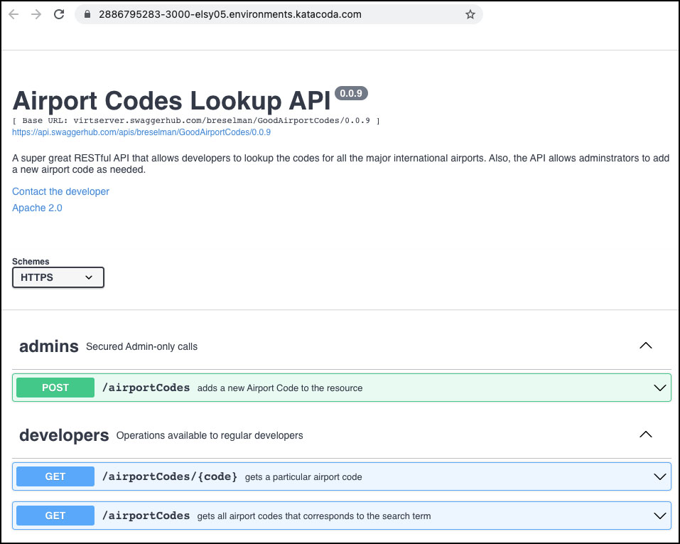

# OpenAPI Viewer

This project is a utility that renders a Swagger/OpenAPI specification hosted on SwaggerHub. The rendering is implemented using the [`swagger-ui-react`](https://www.npmjs.com/package/swagger-ui-react) component within the [React](https://reactjs.org/) framework.



# Getting Up and Running

This application requires [Node.JS](https://nodejs.org/en/download/) and [Yarn](https://classic.yarnpkg.com/en/docs/install) to be installed on your local machine.

Once Node.JS and Yarn are installed, execute the following steps get the application up and running.

**Step 1:** Set the environment variable, `REACT_APP_SOURCE_URL` that declares the source of the Swagger/Open API Spec that needs to be rendered.

For example, 

```
export REACT_APP_SOURCE_URL=https://petstore.swagger.io/v2/swagger.json"

```

When running the code locally, you can set the environment variable in a `.env` file. Place `env` file in the root of this project.

If you do not set the environment variable, the application will default to `https://petstore.swagger.io/v2/swagger.json`.

This project was bootstrapped with [Create React App](https://github.com/facebook/create-react-app).

**Step 2:** Install the npm packages

`yarn install`

**Step 3:** Fire up the Swagger/OpenAPI Spec Viewer

`yarn start`

It will take a minute or two for the development server to start. Be patient. Upon success you'll see output similar to the following:

```
Compiled successfully!

You can now view OpenAPIViewer in the browser.

  Local:            http://localhost:3000
  On Your Network:  http://192.168.86.20:3000

Note that the development build is not optimized.
To create a production build, use npm run build.

```

**Step 3:** View the Swagger/OpenAPI spec in the application

Open [http://localhost:3000](http://localhost:3000) to view it in the browser.

The page will reload if you make edits.

Also, you will see any lint errors in the console.

# Other Stuff

## `yarn test`

Launches the test runner in the interactive watch mode.\
See the section about [running tests](https://facebook.github.io/create-react-app/docs/running-tests) for more information.

## `yarn build`

Builds the app for production to the `build` folder.\
It correctly bundles React in production mode and optimizes the build for the best performance.

The build is minified and the filenames include the hashes.\
Your app is ready to be deployed!

See the section about [deployment](https://facebook.github.io/create-react-app/docs/deployment) for more information.

## `yarn eject`

**Note: this is a one-way operation. Once you `eject`, you can’t go back!**

If you aren’t satisfied with the build tool and configuration choices, you can `eject` at any time. This command will remove the single build dependency from your project.

Instead, it will copy all the configuration files and the transitive dependencies (webpack, Babel, ESLint, etc) right into your project so you have full control over them. All of the commands except `eject` will still work, but they will point to the copied scripts so you can tweak them. At this point you’re on your own.

You don’t have to ever use `eject`. The curated feature set is suitable for small and middle deployments, and you shouldn’t feel obligated to use this feature. However we understand that this tool wouldn’t be useful if you couldn’t customize it when you are ready for it.

## Learn More

You can learn more in the [Create React App documentation](https://facebook.github.io/create-react-app/docs/getting-started).

To learn React, check out the [React documentation](https://reactjs.org/).
